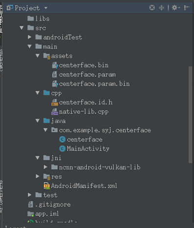
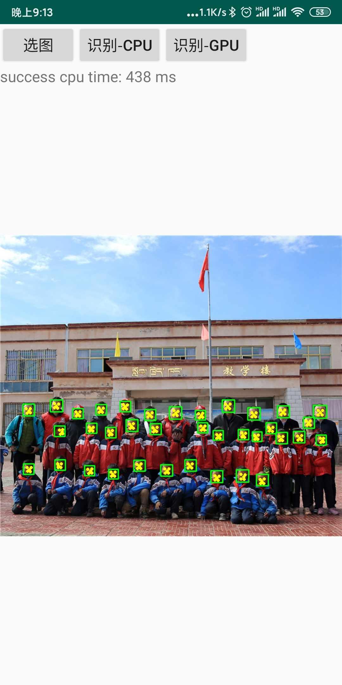

# centerface-ncnn
using ncnn, on android,detection,surport **arm v7/v8/x86**, surport **vulkan** on gpu

## environment
[ncnn](https://github.com/Tencent/ncnn)  
AndroidStudio3.2(NDK19)  
Qualcomm845

## model
using pretrained **centerface** ,by[star-clouds](https://github.com/Star-Clouds/CenterFace)   
**pipeline**:  model on **PC -->   ONNX  ---> model on ncnn(.bin,,param) --> inference on Android**  

## organization
using **ncnn** and **opencv** on android  
the sim-overall android-organization is here

## result
infer time on **845** in float32 is aroud ***350ms(700*500)***, depending on the object  

**ncnn** is good in optimazing on float32

## reference
(https://github.com/JuZiSYJ/MobilenetSSD_Android)
(https://github.com/nihui/ncnn-android-squeezenet)  
(https://blog.csdn.net/qq_33431368/article/details/84990390)